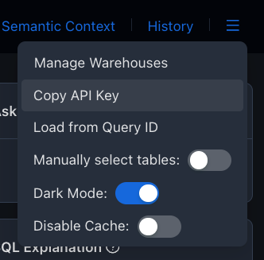

# Waii Python SDK

The `waii-sdk-py` is a Python library that allows you to interact with the Waii API. It provides a powerful SQL and AI capability to your Python applications.

## Installation

To install the `waii-sdk-py`, you can use pip:

```bash
pip install waii-sdk-py
```

## Importing & Initialize the SDK

```python
>>> from waii_sdk_py import WAII
>>> from waii_sdk_py.query import *
>>> WAII.initialize(api_key="<your-api-key>")
```
You can get your API key from the `tweakit.waii.ai` (You need to register and get access from [waii.ai](waii.ai) first).



## Get started 

First you can print the list of available databases:

```python
>>> print([conn.key for conn in WAII.Database.get_connections().connectors])
```

Then, you can activate the database connection you want to use (from one of the key in the list above)

```python
>>> WAII.Database.activate_connection("snowflake://...&warehouse=COMPUTE_WH")
```

Get Database name of the active connection

```python
>>> print([catalog.name for catalog in WAII.Database.get_catalogs().catalogs])
```

```python
>>> print(WAII.Query.generate(QueryGenerationRequest(ask = "How many tables are there?")).query)

SELECT COUNT(DISTINCT table_name)
FROM waii.information_schema.tables
```

Run the query

```python
>>> print(WAII.Query.run(RunQueryRequest(query = "SELECT COUNT(DISTINCT table_name) FROM waii.information_schema.tables")))

rows=[{'COUNT(DISTINCT TABLE_NAME)': 112}] more_rows=0 column_definitions=[ColumnDefinition(name='COUNT(DISTINCT TABLE_NAME)', type='FIXED')] query_uuid='01afbd1e-0001-d31e-0022-ba8700a8209e'
```
