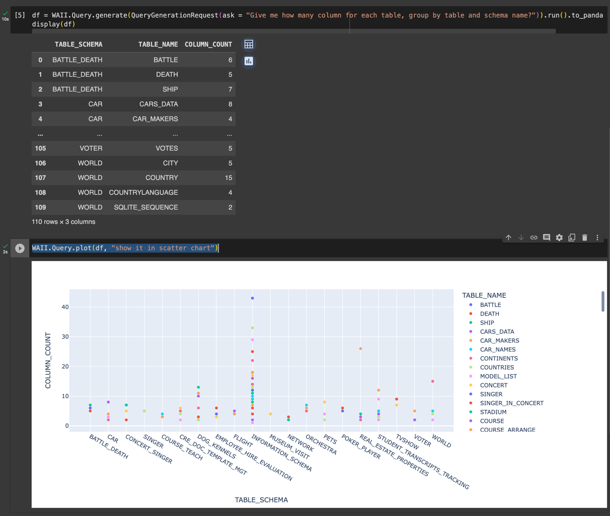

# Create a new notebook

Go to https://colab.google/
Click "New Notebook" on the top-right corner

# Add api-key secret

On the left panel, click the "key" icon


Then enter the WAII API Key (which you get from WAII UI, click hamburger menu on the top-right corner, and click "Copy API Key"). 

NOTE: This is not OPENAI_API_KEY! You need get access to Waii first to get the API Key. (Contact us at https://waii.ai/)


# Install dependencies

```python
!pip install waii-sdk-py
```

# Import waii-sdk-py, and use API key

```python
import pandas as pd
import numpy as np
import plotly.express as px

from waii_sdk_py import WAII
from waii_sdk_py.query import *

from google.colab import userdata
api_key = userdata.get('waii_api_key')

WAII.initialize(url='https://tweakit.waii.ai/api/', api_key=api_key)
```

# Get all connectors, generate query, and show chart

```python
df = WAII.Query.generate(QueryGenerationRequest(ask = "Give me how many column for each table, group by table and schema name?")).run().to_pandas_df()
display(df)
WAII.Query.plot(df, "show it in scatter chart")
```

You should be able to see the result like


# Upload CSV and plot

Use this code to upload CSV file

```python
# upload csv and try
from google.colab import files
uploaded = files.upload()
```

Click `Choose Files` button, and select the CSV file to upload

Once it is done, you can use 
```python
df = pd.read_csv('<the file name you just uploaded, such as flight-data.csv>')
df.head()
```

After that, you can just use WAII.Query.plot to plot the chart

```python
WAII.Query.plot(df, "show me number of flights by month")
```

# More examples 

You can find a full example notebook [here](doc/colab-notebook-example.ipynb).

# More information

Checkout [Use Notebook](USE_NOTEBOOK.md) for more information.
