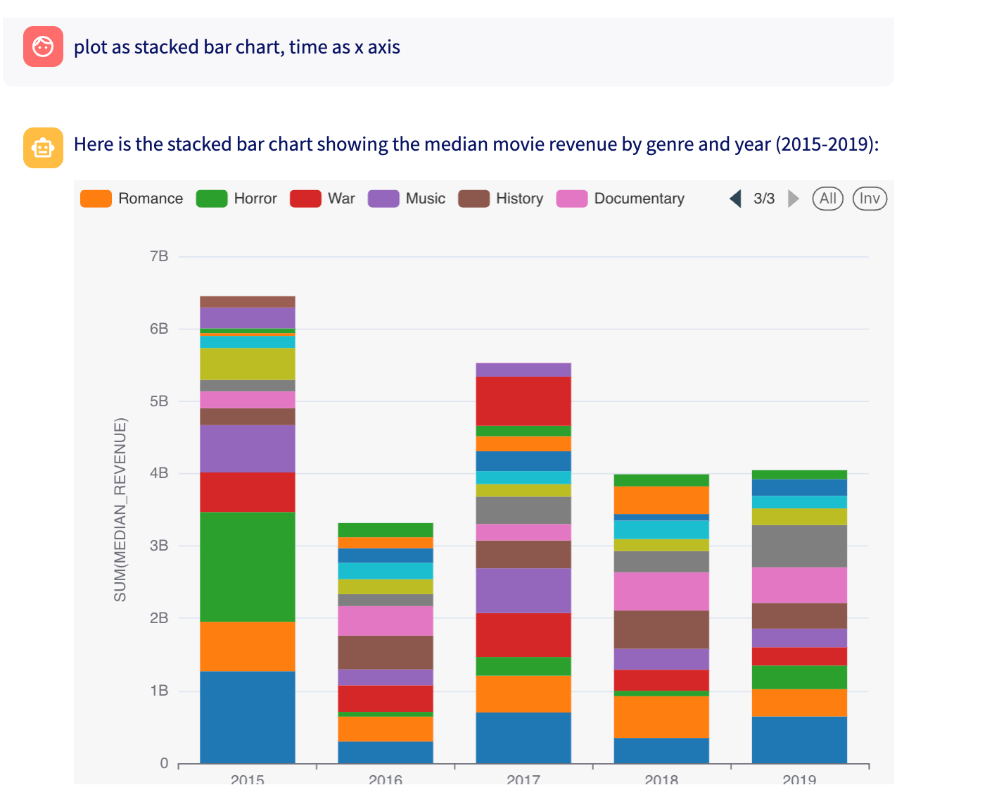

The `Chat` module contains methods to interact with a SQL Chatbot.

**Important:** You need to activate the database connection first before using the methods in this module. Otherwise, you may be conversing with the wrong database.
```python
WAII.Database.activate_connection("snowflake://...&warehouse=COMPUTE_WH")
```

Here are some of its methods:

### Send Chat Message

```python
WAII.Chat.chat_message(params: ChatRequest) -> ChatResponse
```

This method sends a message to the chatbot based on the provided parameters.

- `ask`: The question you want to ask the chatbot regarding your database `How many tables are there?`
- `parent_uuid`: The uuid of the previous chat message if you want to continue the conversation
- `use_cache`: Whether to use cache or not, default is True. If you set it to False, it will always generate a new query by calling LLM.
- `model`: Which LLM to be used to generate queries. By default system will choose a model.
- `chart_type`: Currently waii supports vegalite, superset and metabase

The ChatResponse contains different objects that represent the answer to the question
- `response`: A templated response representing the answer to the question. The values for the templates can be found in the chat_response_data. The possible templates will be listed in the template section
- `chat_uuid`: The uuid of the message, use this uuid as the parent uuid to continue the conversation
- `is_new`: If sql was generated to answer this question, this field is true if the sql has been identified as a new query, not a tweak of the previous query that was maintained during the conversation
- `timestamp`: The timestamp of the chat response
- `response_data`: A `ChatResponseData` object containing the generated info for the question. A `ChatResponseData` object looks like
  - `semantic_context`: A `GetSemanticContextResponse` object containing the semantic context from the database related to the ask and generated query
  - `catalog`: A `CatalogDefinition` object containing the related tables to the question, if created
  - `sql`: A `GeneratedQuery` object containing the generated query to answer the question, if created
  - `data`: A `GetQueryResultResponse` object containing the result of the generated query if it was run
  - `chart_spec`: A `ChartGenerationResponse` object containing the information for the visualization

**Examples:**
    
Ask a new question:
```python
>>> response = WAII.Chat.chat_message(ChatRequest(ask = "How many tables are there?"))
```

**Ask a follow-up question:**
```python
>>> response = WAII.Chat.chat_message(ChatRequest(ask = "tables with more than 100 rows?", 
                                                  parent_uuid=response.chat_uuid))
```

**Response Templates**

Template names will be enclosed in {}, such as {tables}
- `tables` The database tables that were used to generate the results (just a list of the names)
- `sql` The query generated to answer the question from the database
- `data` The data generated by running the query
- `steps` A step-by-step explanation in English of how results were computed from the database
- `compilation_errors` The compilation errors for the generated sql detected by our SQL compiler
- `graph` A graphical representation of the data from the database
   

## Supported Chart Types:

Currently waii supports vegalite, superset and metabase

### Vegalite Chart

Request:

```
response = WAII.Chat.chat_message(ChatRequest(ask="Draw a bar graph showing revenue per year", chart_type = ChartType.VEGALITE ))
```

Response:

```
{
    "response": "Here is a bar graph showing the total revenue per year for movies released after 1980: \n\n<chart>",
    "response_data": {
        "data": {
            "rows": [
                {
                    "START_YEAR": 1981,
                    "TOTAL_REVENUE": 195312802
                },
                {
                    "START_YEAR": 1982,
                    "TOTAL_REVENUE": 439506293
                }
            ],
            "more_rows": 0,
            "column_definitions": [
                {
                    "name": "START_YEAR",
                    "type": "FIXED"
                },
                {
                    "name": "TOTAL_REVENUE",
                    "type": "FIXED"
                }
            ],
            "query_uuid": "beef22fc-0a96-4688-bf4f-9c53df55f72c"
        },
        "query": {
            "query": "SELECT\n    start_year,\n    SUM(revenue) AS total_revenue\nFROM movie_db.movies_and_tv.movies\nWHERE\n    start_year > 1980\nGROUP BY\n    start_year\nORDER BY\n    start_year\n",
            }
        },
        "chart": {
            "uuid": "0b86e535-2e20-42ad-ba0f-95f56f6cf1a5",
            "chart_spec": {
                "spec_type": "vegalite",
                "chart": "{\"$schema\":\"https://vega.github.io/schema/vega-lite/v5.json\",\"data\":{\"url\":\"waii_data.json\"},\"mark\":\"bar\",\"encoding\":{\"x\":{\"field\":\"START_YEAR\",\"type\":\"ordinal\",\"axis\":{\"title\":\"Start Year\",\"labelAngle\":45}},\"y\":{\"field\":\"TOTAL_REVENUE\",\"type\":\"quantitative\",\"axis\":{\"title\":\"Total Revenue\",\"grid\":true}}},\"tooltip\":[{\"field\":\"START_YEAR\",\"type\":\"ordinal\",\"title\":\"Year\"},{\"field\":\"TOTAL_REVENUE\",\"type\":\"quantitative\",\"title\":\"Revenue\"}]}"
            }
        }
    }
```

You can get the vegalite chart specs using 

```
response.response_data.chart.chart_spec
```

for the above example the chart spec are as follows:

```
{
"$schema": "https://vega.github.io/schema/vega-lite/v5.json",
"data": {
    "url": "waii_data.json"
},
"mark": "bar",
"encoding": {
    "x": {
    "field": "START_YEAR",
    "type": "ordinal",
    "axis": {
        "title": "Start Year",
        "labelAngle": 45
    }
    },
    "y": {
    "field": "TOTAL_REVENUE", 
    "type": "quantitative",
    "axis": {
        "title": "Total Revenue",
        "grid": true
    }
    }
},
"tooltip": [
    {
    "field": "START_YEAR",
    "type": "ordinal", 
    "title": "Year"
    },
    {
    "field": "TOTAL_REVENUE",
    "type": "quantitative",
    "title": "Revenue"
    }
]
}
```

You would need to replace data in the above  to view the actual chart i.e.,

```
response.response_data.chart.chart_spec.data = {
    "values":
    response.response_data.data.rows
}
```

Actual chart:

[Open the Chart in the Vega Editor](https://vega.github.io/editor/#/url/vega-lite/N4IgJghgLhIFygG4QDYFcCmBneBtUAygCoCCASkQPoCaAoufAIwCcAzAKwA0IRA8qQBlKZWgDVaAOQCqteACYADEuXcA1hgCe8BQF9OhUhRr0yTZgDZW3PoOFjJM+AHYAHC+Yun5riHVa4jHoG5FR0DAEWACzW-CRCIuLSsgFykW6MCuZyapryQSDEIcbhLN4xtgkOyYyRjCzs3i45-qz5hUZhphHmTuVxdomOAXXsLpGuvb65cJFthqEmZubMffH2SfAuLE6RkWzN8OxzRZ1mTgqrA1VM7szMToxNU-7mxx2LEQ+XlRvD5gr1cYHOBON4LEr3Kw8WJrQbVcyMJxIlysczAlxg4pdbbRaEVdZDRQApxEi7PeDMTGnT5ovH9H5DSJZVEqckBXT6ArzLFnSY2ekE5JyRjsSKsFw9KF+JiBTntcHY+5Pfmw65wOTeR4cHzSlJUj7bFZ01W-OTMUXMBRydhG3WMVpy7nUlguMkqq6-CUNVw9Wl22aOk4GjyMb6CszsViMOSu7JskX6iEuOPuhnJMXmzJmqXTRivQPvJNQ1PhuA9LysOSsBRPO2ggsKsxjMNw+B7GqRDXMON2jENnkRFw+EutuBsNKV3aTO2U-vOjy0kdq-6RBTsEU14GKROKzwt5f3NgsJlb2XBQu75Uwj1DBqinpDv3TORyHdNo1L34ivNOS33XG6lWb4RJa+6-OYuxDkoJJbgG56NiBobGjeySeKwTJKKwOb+NawEsN2YFDNGrAkk4JHsGSgH5vBA74cW15pocebiuYlgAc+9Y0fOzC4p+jKdrs1YsFufZccG5qEdUtRrgoOwNFus5iRCFiSfIZpyK4njTtM1Z4XcfIMaW0bGZ27g6jpZ5ckGylXvio7mO47hYdWwKVnpdyqeqwpeE4oy7K5DpKV0pKedGig7MwIpPi0cFWRe8hKEhfHVK6JEKGkmSuUcc4fESKaGaOkTrhw0YKDxrnUXFCFEvRdlqpGTKRSK7A9jpnFVQORK8QV9VWmkEoSuxLSiR11JEsOPWmpGwo2i1lE6Ypo25Uoi6TYyEp3Ouv7RW2HJBQlsmeQ5EFrjsGrArUwFErZAqFVsaQQdG5n+J2V1KB+a3JFkAIKM5iIXYFS3hIoGRHWwSLrhRrUvbF8qdQCSWfRSrgcOlMa2tMRVvdGnnuEi1YkqDbJMtjtW3WqGQPhwFisBjL3tXDY0At1dW-JFNa7HUGkXSNjPLSKoUur5lpMkhup7Njq2s0MaE2nm7g7XAFHYwZ0vVOhj5WsywLrtjN0mkRslkd2bgqWyLXYx9avODTp3sPJ5utAAunoIAALYQAATqo8CgFAGgAA4YPAIAAEZeyA3AAMYoAAlgH8BQJ7mCuxgAB2UcAPZgLHacAOa+yAAAehcAGaxxgKBgCHfMMNw-tByHACOaAQGnUCxzAHeIMH3AQEXsc4AgIAd1AKDB3ABQwJ7UAAATUBgEfcCgECh5XJD5+PbY+B3UeqAAwpnaDtwl3Cl5nnse1AIfV67WAX9fk9p2gKAoCArv+KA5eV9Xk-JZHI9A4TxAC3Nuo9oCxx7gA-ug9C6jy3n-TOMAUCzzIBgHuz9e4gBXmvFAtAi4B09iHVeWAAAUkAoBoDdgAOmQOgDAABKWeAA+AAvLPDIyguEKFngAflnufS+0ByHQCobQ1AmAAD0nDuFKE4LPAA5GABRTCADUiiABCCjZ5wFniQkRlCaF0MwEwthHDZF8IERfK+BixHGIwNI2R8ilEqNnuohRABZbRuj9EULsRIxhLD2EyMsYImxfijEBMcXIxRyi1GKIANLeKsUIqAtjIn0OcXE9+3B74zxDs-V+79XbwOAWgjBmBZ5B09vPReRDcmVwwFHDumc06FwAF6Z0zm7OBQCQ65ygBgT2dCAGh1zr-EAWAo6oGwAA9OWcc75yHrgYuACtBO3rp7NuWAV6DJDrgN2R8sAYDAJnAA7mnXA6D05QGoVgAAFrHUuUAEmaA2bPQ5aBjloADk7FhHyjkYEOVA7gnTukhzOfcjAlcACEVyMG3OaZ7FAryNCzwAD7otntc9u1C3YYBgKip2xTo6tPLgXYe58T6TwAJLtyGfIrA2yAC0xzPZPNGRAPeedPZHzThMgAxKXBQwrhUANKYXLOKAL4hwFc5ZyACqWP0mSytlHKz6tKgAQWO7SJ72moe9bsrsYFD1AKcj2ud4Cl1QMc7g5qIC50PtKohk85XytYAAnlscwBOpla6qOAbA3itjnvX1LqQBuvlcGseGAw2yvdR65eq9K5xtdQmgBODK4ADFNXat1UwBQ1Cxh5nrp3ceOb255r1Ywah3Z2BeFduPPO6df5+zLbGzOzr43uozcmlAqaI3pqTbgitWqdV6sLcW2kpTR1VplLW60DbuAe29pKztfqI2MFLkiUOkQAFYCTpndQ3ao2NtzhPUAB7eXHtdZEDAv4IBOH3Ye9QAB1b1UB7lMFyS+2NEAE6T15cfW+3BEAVzOYXK9R7gFJ22QHL2NyckgC2fnC9IBpmDLzhffwKyBV3ofU+7gQqYwYDkFHABAqMAimFhRrwocnChzkBRm0EAailwoycqOPFmAUYgNuiArGKOl1LswSAhGI3MCjr5dg7GiPh1DgoVeFHGAYEtMJoT27S4UQo5WKOYBKwaeWLuij4d7b6Z01HUOJFGAabAOcBQFHFCMYE0JmsbmKOeCjhga1IANngEgUMvOucKW4bsywRg5GiOl0gBgBEGnhOh1kxG1eYBIB7qI3IUOKJw6+e4FC6AHsAO4dLtC9gYAeNRemapmzUXQ7mAgJEWARGwCkbABqXjFFS4il8yUjARdH6gClRuyNCqdCuzOR+r9SsLZAA)


## Superset Chart

Request:

```
response = WAII.Chat.chat_message(ChatRequest(ask="Draw a bar graph showing revenue per year", chart_type = ChartType.SUPERSET ))
```

Response:

```
{
"response_data": {
        "data": {
            "rows": [
                {
                    "START_YEAR": 2015,
                    "TOTAL_REVENUE": 11987590461
                },
                {
                    "START_YEAR": 2016,
                    "TOTAL_REVENUE": 8735916896
                }
            ],
            "more_rows": 0,
            "column_definitions": [
                {
                    "name": "START_YEAR",
                    "type": "FIXED",
                },
                {
                    "name": "TOTAL_REVENUE",
                    "type": "FIXED"
                }
            ],
            "query_uuid": "14b6f72e-7379-4a34-8d57-661a2b6f8964"
        },
        "query": {
            "query": "SELECT\n    start_year,\n    SUM(revenue) AS total_revenue\nFROM movie_db.movies_and_tv.movies\nGROUP BY\n    start_year\nORDER BY\n    start_year\n"
        },
        "chart": {
            "uuid": "489ab1f2-f4e2-4bd3-9e66-b758e97451cb",
            "chart_spec": {
                "spec_type": "superset",
                "generation_message": null,
                "chart_title": "Total Revenue Per Year",
                "superset_specs": {
                    "datasource": "",
                    "viz_type": "echarts_timeseries_bar",
                    "y_axis_title_margin": 40,
                    "color_scheme": "d3Category10",
                    "x_axis": "START_YEAR",
                    "metrics": [
                        {
                            "expressionType": "SQL",
                            "sqlExpression": "SUM(TOTAL_REVENUE)",
                            "label": "SUM(TOTAL_REVENUE)"
                        }
                    ],
                    "y_axis_title": "SUM(TOTAL_REVENUE)"
                }
            }
        }
    }
}
```

To create chart in superset,
you would need to first create dataset in superset using /api/v1/dataset/ api

Here's simple script:

```
    dataset = self.client.post(f"{self.client.host}/api/v1/dataset/", json={
        "database": database_id,
        "sql": sql_query,
        "table_name": dataset_name,
        "normalize_columns": True
    })
```

you can get the sql_query from

```
response.response_data.query.query
```

After creating dataset you can pass these specs to /api/v1/explore/permalink

Note: You would need to replace "datasource": "", with the dataset id you get in previous step

Here's simple script to do that:

    superset_specs["datasource"] = f"{dataset_id}__table"
    permlink_payload = {
        "formData": superset_specs
    }

    permlink = self.client.post(f"{self.client.host}/api/v1/explore/permalink", json=permlink_payload)

permlink will have the superset url which you can embed in your application. 

Here's an example chart:

superset chart embedded in streamlit app:

