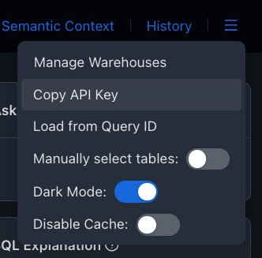

To install the `waii-sdk-py`, you can use pip:

```bash
pip install waii-sdk-py
```

## Importing & Initialize the SDK

```python
>>> from waii_sdk_py import WAII
>>> from waii_sdk_py.query import *
>>> WAII.initialize(url='...', api_key="<your-api-key>")
```
You can get your API key from the Waii server UI you have access to (You need to register and get access from [waii.ai](https://waii.ai) first).

URL is the base URL of the WAII API, depends on the URL for the environment you are using: 
- If you are using prod environment (sql.waii.ai, or tweakit.waii.ai), you can use 'https://sql.waii.ai/api/'
- If you are using test environment (sql.test.waii.ai, or tweakit-test.waii.ai), you can use 'https://sql.test.waii.ai/api/'
- If you are using local Docker environment, you can use `http://host:port/api/` (host/port are point to Waii server)


