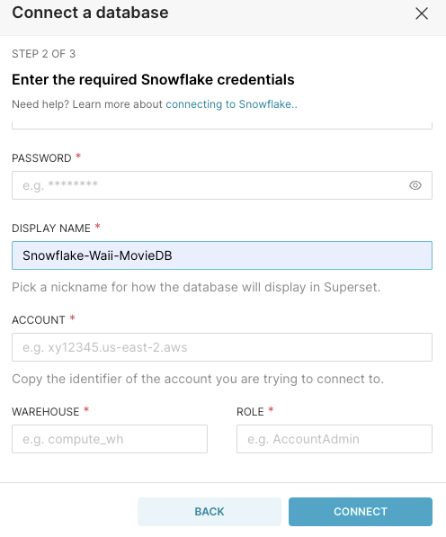
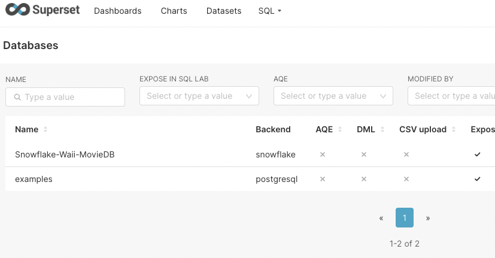
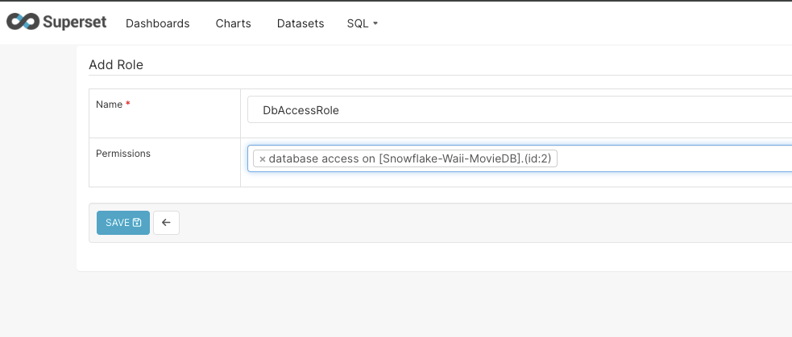
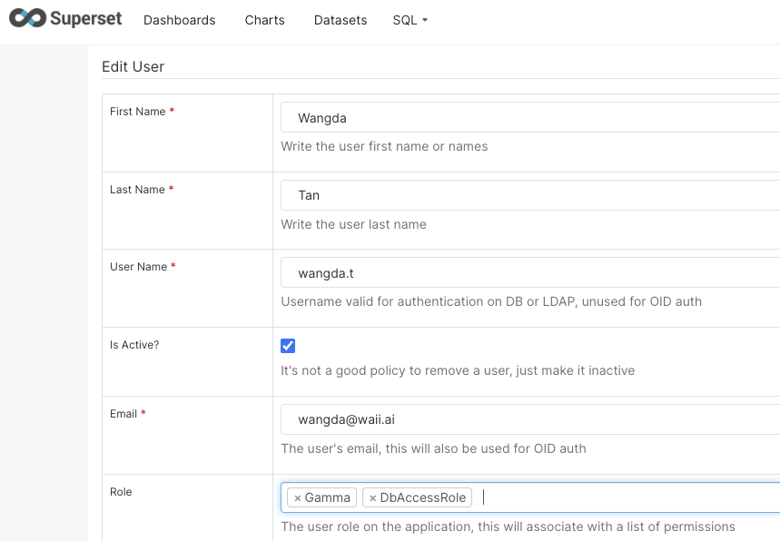
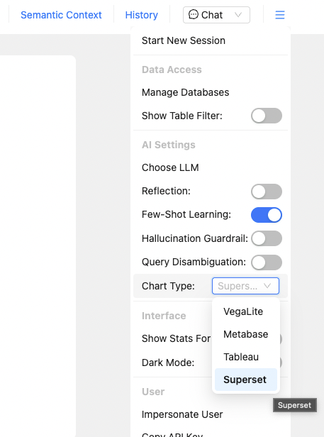
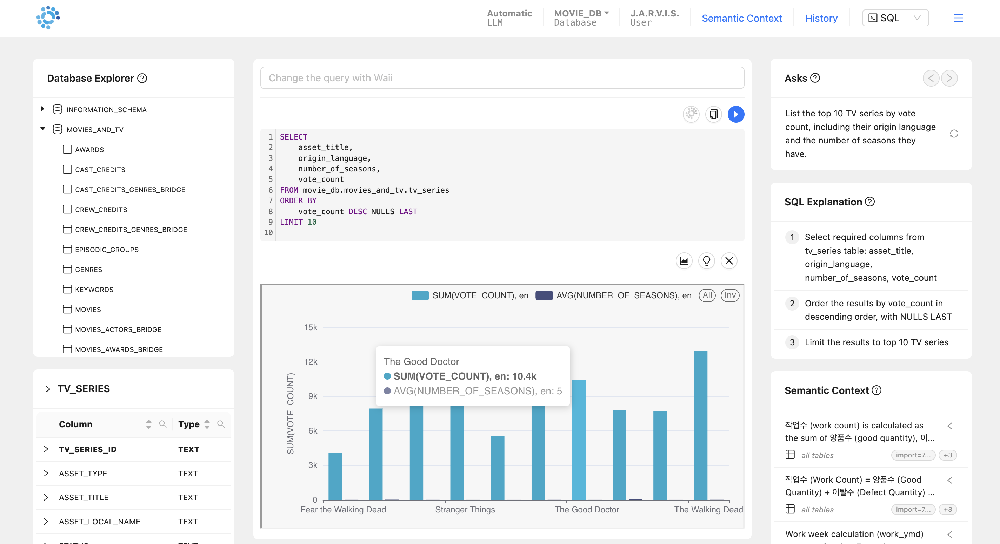
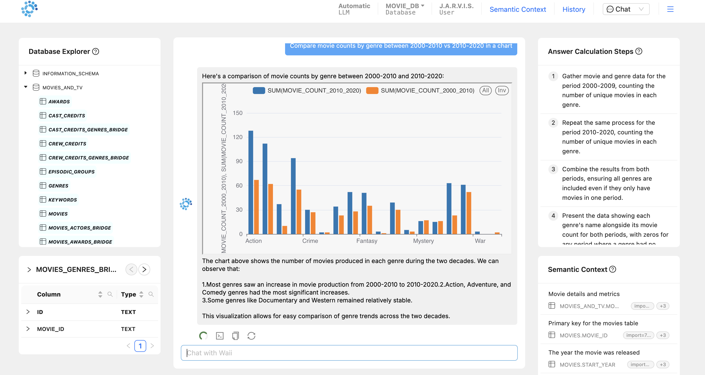

# Superset + Waii Usage

## Setup Steps

### 1. Add Database Connection to Superset

- The name (or Display Name) used while adding the connection to Superset will be used while adding the connection to WAII as well.





You will use this name while adding the connection to Waii: [Database Module Documentation](https://doc.waii.ai/python/docs/database-module)

Example:

```python
WAII.Database.modify_connections(ModifyDBConnectionRequest(
    updated=[
        DBConnection(
            # existing fields
            parameters={
                "superset_dbname": "Snowflake-Waii-MovieDB"
            }
        )
    ]
))
```

Replace "Snowflake-Waii-MovieDB" with the name that you used while adding the Superset connection.

### 2. Add User Permissions

- Add permission for the user to access the database along with some basic permissions (Refer to [gamma role documentation](https://superset.apache.org/docs/security/#gamma))





### 3. Create User in WAII and Add Superset Secrets

Create the user in WAII and add the Superset secrets this way:

```python
user = User(
    id="wangda@example.com", 
    name="Wangda", 
    tenant_id="my_tenant_id", 
    org_id="my_org_id", 
    roles=[WaiiRoles.WAII_TRIAL_USER]
)

create_user_request = CreateUserRequest(user=user)
WAII.User.create_user(create_user_request)

create_secret_request = CreateSecretRequest(
    user=user, 
    secret={
        "superset.credential": {
            "superset.host": "http://<super set host>",
            "superset.username": "wangda.t",
            "superset.password": "xxxx"
        }
    }
)

WAII.User.create_secret(create_secret_request)
```

### 4. Choose Superset Chart Type in WAII UI

In the WAII UI, select chart type as Superset:




You should now be able to generate charts in editor and chat mode:




